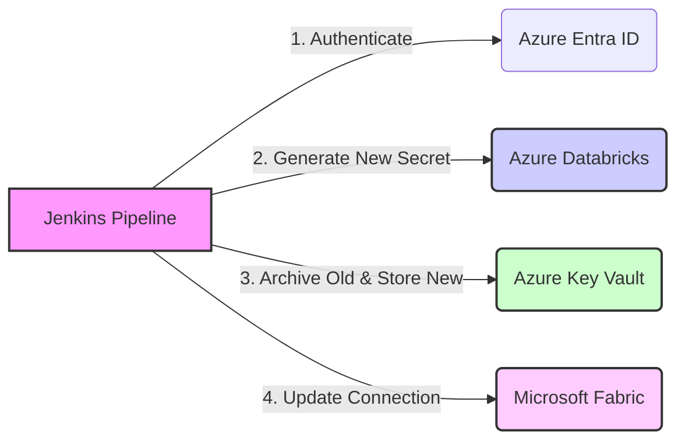

---

# Automated Service Principal (SPN) Key Rotation Pipeline

**Version:** 2.0 (Industry Standard)

**Orchestrator:** Jenkins

**Target Ecosystem:** Azure Databricks, Azure Key Vault, Microsoft Fabric

## 1. Executive Summary

This project implements a robust, automated security pipeline designed to rotate Service Principal (SPN) credentials across the Azure Data Ecosystem.

* **Enhanced Security:** Eliminates static, long-lived credentials by frequently rotating keys.
* **Zero Downtime:** Synchronizes secret rotation across storage (Key Vault), generation (Databricks), and consumption (Microsoft Fabric) in a single atomic operation.
* **Compliance:** Adheres to industry standards for logging, error handling, and auditability.

---

## 2. High-Level Architecture

The pipeline orchestrates a secure "handshake" between three critical Azure services.



### The Workflow Flow

1. **Initiation:** Jenkins triggers the job for a list of SPNs.
2. **Generation:** Pipeline requests a new OAuth secret from Azure Databricks (valid for 1 year).
3. **Storage:** Secret is vaulted in Azure Key Vault; previous versions are disabled.
4. **Synchronization:** Pipeline connects to Microsoft Fabric and updates the connection live.

---

## 3. Technical Implementation

The solution is modular, built on a core library of shared functions.

### Repository Structure

> **Note:** Use "Code Blocks" to prevent the file tree from collapsing.

```text
.
├── Jenkinsfile                  # Orchestration Logic (Groovy)
└── scripts/
    ├── lib/
    │   └── utils.sh             # Core Library (Logging, Validation, Strict Mode)
    ├── get_token.sh             # Authenticates Master SPN
    ├── fetch_internal_id.sh     # Maps Display Name -> Databricks Internal ID
    ├── delete_old_secrets.sh    # Cleanup logic (Limits management)
    ├── create_oauth_secret.sh   # Secret Generation API calls
    ├── store_keyvault.sh        # Key Vault Versioning & Storage
    └── update_fabric_connection.sh # Fabric CLI Wrapper (Python)

```

### Key Technical Features

* **Defensive Coding:** All scripts run in strict mode (`set -euo pipefail`).
* **Atomic Operations:** Actions are verified before proceeding.
* **Self-Healing Environment:** Automatically builds Python virtual environments and cleans up sensitive files (`db_env.sh`).

---

## 4. Prerequisites & Requirements

### 4.1 Jenkins Environment

* **Agent:** Linux (Ubuntu/Debian recommended).
* **Binaries:** `bash`, `curl`, `jq`, `az` (Azure CLI), `python3`.
* **Plugins:** Credentials Binding, Timestamper.

### 4.2 Credentials (Jenkins Global Store)

| Credential ID | Description |
| --- | --- |
| `azure-client-id` | Client ID of the Master SPN |
| `azure-client-secret` | Client Secret of the Master SPN |
| `azure-tenant-id` | Azure Tenant ID |
| `keyvault-name` | Name of the target Azure Key Vault |

---

## 5. Disaster Recovery & Troubleshooting

| Issue | Potential Cause | Remediation |
| --- | --- | --- |
| **HTTP 403** | Master SPN lacks RBAC roles | Check Databricks Account Console & KV IAM |
| **Connection not found** | Naming mismatch in Fabric | Ensure connection is named `db-[SPN-NAME]` |
| **Pipeline Failure** | Transient Network/API error | Pipeline is idempotent; Re-run the job |

---

### Why your previous version changed structure:

1. **The File Tree:** Without the ````text` block, Markdown treats the lines as regular text and removes the leading spaces, destroying the visual "tree."
2. **The Diagram:** You used a Mermaid diagram syntax. On GitHub, you must wrap it in ````mermaid` for it to render as a visual chart.
3. **Tables:** Standard text tables often misalign. Using the `| Col |` Markdown table syntax ensures it stays formatted on any screen size.

**Would you like me to help you write the `Jenkinsfile` logic that handles the parallel execution for the `SPN_LIST`?**
